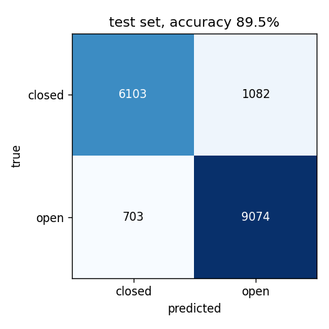
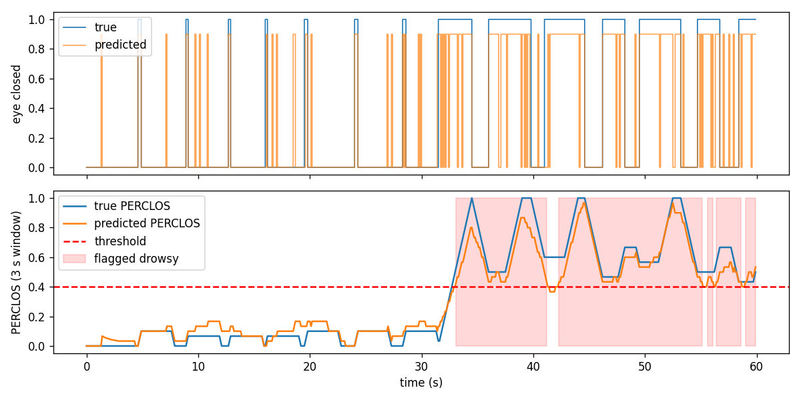

# Drowsiness Detection From Scratch (NumPy Neural Network)

Course project for Linear Algebra. A small neural network written with only
NumPy that classifies an eye image as **open** or **closed**, plus a simple
rule (PERCLOS) that turns those predictions into a drowsiness flag.

No PyTorch / TensorFlow / sklearn. Forward pass, backpropagation and gradient
descent are all written out as matrix operations in [src/model.py](src/model.py).

The full write-up with the math is in [report/report.md](report/report.md).

## Results

Network: 576 inputs (24×24 image) → 64 hidden (ReLU) → 2 outputs (softmax).

| | accuracy |
|---|---|
| validation (5 people) | 95.0% |
| **test (7 people never seen in training)** | **89.5%** |
| majority-class guess on test | 57.6% |
| same model with a random image split (leaky, see report) | 97.1% |

Train / validation / test are split by **person**, not by image, because the
images are video frames and neighbouring frames are nearly identical.




## How to run

```
pip install -r requirements.txt
```

Download `mrlEyes_2018_01.zip` from the
[MRL Eye Dataset page](http://mrl.cs.vsb.cz/eyedataset) and put it in `data/`
(no need to unzip). Then, from the project folder:

```
python src/data.py            # zip -> data/eyes_24x24.npz (takes ~20 s)
python src/gradcheck.py       # check backprop against numerical gradients
bash experiments/run_all.sh   # all tuning runs + final model (a few minutes)
python src/evaluate.py        # test set results
python src/perclos_demo.py    # drowsiness demo
python src/pca.py             # eigen-eyes
```

## Files

```
src/
  data.py          load images, split by person, standardize, shift augmentation
  model.py         the network: forward, backward, update
  gradcheck.py     numerical gradient check + overfit-50-images check
  train.py         mini-batch gradient descent, logs each run
  evaluate.py      test accuracy, confusion matrix, mistakes
  perclos_demo.py  eye state -> drowsy / not drowsy on a simulated sequence
  pca.py           PCA of the eye images with the SVD
experiments/
  run_all.sh              every tuning run, in order
  log.csv                 results of those runs
  random_split_check.py   shows how much a random split inflates accuracy
results/           plots, saved model, printed outputs
report/report.md   derivation of backprop, experiments, discussion
```
