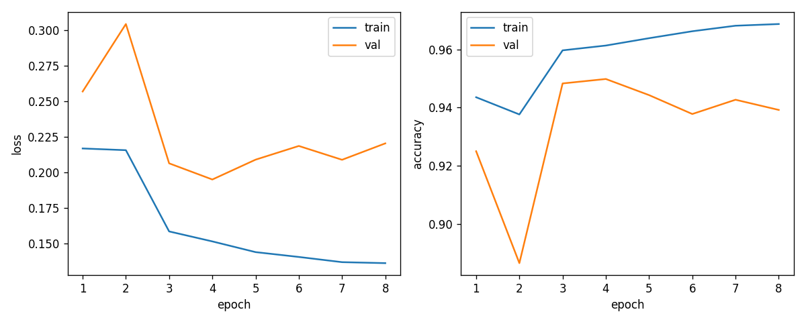
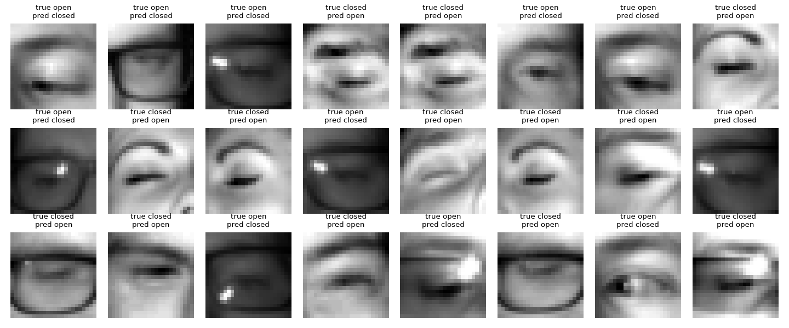
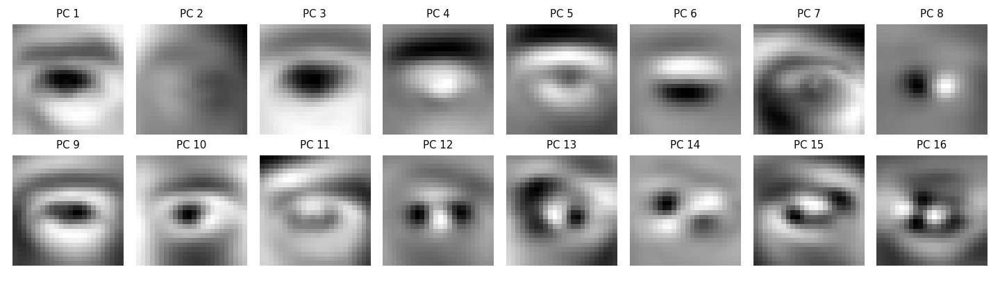

# Drowsiness Detection with a Neural Network Written in NumPy

Linear Algebra course project

## 1. What I did

I wrote a small neural network using only NumPy (no PyTorch, no sklearn) that
looks at a 24×24 picture of an eye and says if it is **open** or **closed**.
On top of that I added a simple rule (PERCLOS) that turns a stream of
open/closed predictions into "this person looks drowsy".

I picked this because a neural network is basically a chain of matrix
multiplications, and training it (backpropagation) is the same chain run
backwards with transposes. I wanted to write all of it myself at least once
instead of calling `model.fit()`.

## 2. Data

[MRL Eye Dataset](http://mrl.cs.vsb.cz/eyedataset): 84,898 infrared eye images
from 37 people, labeled open or closed (41,946 closed, 42,952 open).

Preprocessing (`src/data.py`):

- grayscale, resize to 24×24, flatten into a vector in $\mathbb{R}^{576}$
- scale pixels to [0, 1]
- standardize each pixel using the mean and std of the **training set only**

**Split by person.** The images are frames from videos, so two neighbouring
frames of the same person are almost the same picture. If I shuffle all images
and split randomly, the test set is full of near-copies of training images. So
I split the 37 *people* instead: 25 train / 5 validation / 7 test.

| | people | images | % open |
|---|---|---|---|
| train | 25 | 52,210 | 50.2 |
| validation | 5 | 15,726 | 44.3 |
| test | 7 | 16,962 | 57.6 |

(The image counts are not exactly 70/15/15 because some people have way more
images than others.)

## 3. The model as linear algebra

I store one image per **row**, so a batch of $m$ images is a matrix
$X \in \mathbb{R}^{m \times 576}$. The final network has one hidden layer with
64 units:

$$Z_1 = XW_1 + b_1 \qquad A_1 = \max(0, Z_1)$$

$$Z_2 = A_1W_2 + b_2 \qquad P = \text{softmax}(Z_2)$$

| matrix | shape | what it is |
|---|---|---|
| $X$ | $m \times 576$ | batch of images |
| $W_1$ | $576 \times 64$ | first layer weights |
| $Z_1, A_1$ | $m \times 64$ | hidden layer before / after ReLU |
| $W_2$ | $64 \times 2$ | second layer weights |
| $Z_2, P$ | $m \times 2$ | scores / probabilities for (closed, open) |

Each layer is an affine map (a matrix multiplication plus a shift). Doing the
whole batch at once is one matrix product instead of a loop over images.

**Why the ReLU is needed.** Without it the two layers would collapse into one:

$$(XW_1 + b_1)W_2 + b_2 = X(W_1W_2) + (b_1W_2 + b_2)$$

which is just another affine map with the matrix $W_1W_2$. So no matter how
many layers I stack, without a nonlinearity the network can only do what
logistic regression does. (I checked this: logistic regression got about 90%
on validation, the network with a hidden layer about 94-95%.)

**Softmax** turns each row of scores into probabilities that sum to 1:

$$P_{ik} = \frac{e^{Z_{ik}}}{\sum_j e^{Z_{ij}}}$$

**Loss** is the average cross-entropy, where $y_i$ is the correct class of
image $i$:

$$L = -\frac{1}{m}\sum_{i=1}^{m} \log P_{i,y_i}$$

## 4. Backpropagation

I need the derivative of $L$ with respect to every weight. I write $dW$ for
$\partial L/\partial W$, which has the same shape as $W$.

**Step 1: the output layer.** For one image with scores $z$ and correct class
$y$, $L = -\log p_y = -z_y + \log\sum_j e^{z_j}$. Taking the derivative with
respect to $z_k$:

$$\frac{\partial L}{\partial z_k} = -[k = y] + \frac{e^{z_k}}{\sum_j e^{z_j}} = p_k - [k=y]$$

So for the whole batch, with $Y$ the one-hot matrix of the labels:

$$dZ_2 = \frac{1}{m}(P - Y)$$

This was the nicest part. The softmax and the log cancel and what's left is
just "prediction minus truth".

**Step 2: the weights of a layer.** Since $Z_2 = A_1W_2 + b_2$, entry
$(i,k)$ of $Z_2$ is $\sum_j (A_1)_{ij}(W_2)_{jk} + (b_2)_k$. The weight
$(W_2)_{jk}$ touches $Z_2$ in column $k$ of every row, so by the chain rule

$$\frac{\partial L}{\partial (W_2)_{jk}} = \sum_i (A_1)_{ij}\,(dZ_2)_{ik}
\quad\Longrightarrow\quad dW_2 = A_1^{T}\, dZ_2$$

$$db_2 = \text{sum of the rows of } dZ_2$$

A shape check helps: $A_1^T$ is $64 \times m$ and $dZ_2$ is $m \times 2$, so
the product is $64 \times 2$, same as $W_2$. It's the only way to multiply
those two matrices that gives the right shape.

**Step 3: going back one layer.** Same idea but for $A_1$:

$$dA_1 = dZ_2\, W_2^{T}$$

and the ReLU just passes the gradient through where $Z_1$ was positive and
blocks it where it was negative ($\odot$ is element-wise):

$$dZ_1 = dA_1 \odot \mathbf{1}[Z_1 > 0]$$

**Step 4:** same as step 2:

$$dW_1 = X^{T}\, dZ_1 \qquad db_1 = \text{sum of the rows of } dZ_1$$

**The pattern:** going forward I multiply by $W$ on the right, going backward
I multiply by $W^T$ on the right. Forward maps 576 → 64 → 2, backward maps
2 → 64 → 576. Backprop is the transposes of the forward matrices applied in
the opposite order.

**Gradient descent** then moves every parameter a little bit against its
gradient, with learning rate $\eta$:

$$W \leftarrow W - \eta\, dW$$

With L2 regularization the loss gets an extra $\frac{\lambda}{2}\lVert W\rVert_F^2$
for each weight matrix, which adds $\lambda W$ to $dW$.

## 5. Checking that it's correct

Before training anything real (`src/gradcheck.py`):

1. **Numerical gradient check.** On a tiny network I compared my backprop
   gradients with $\frac{L(w+\epsilon) - L(w-\epsilon)}{2\epsilon}$ for every
   single weight. The relative error was around $10^{-11}$ for all the weight
   matrices and biases, so the formulas above are right.
2. **Overfit 50 images.** The network got 100% on 50 random training images.
   (My first version of this test used the *first* 50 images, which turned out
   to all be the same person with the same label, so it passed for the wrong
   reason. Fixed by picking 50 random ones.)

## 6. Tuning

I changed one thing at a time and logged every run to `experiments/log.csv`
(`experiments/run_all.sh` has the exact commands). Everything here is
**validation** accuracy. "best" is the best epoch (the weights I keep),
"last" is the final epoch.

| step | change | val best | val last | note |
|---|---|---|---|---|
| 0 | baseline: 32 hidden, full batch, lr 0.1, raw pixels, small random init | 55.7% | 44.3% | doesn't learn, predicts one class |
| 1 | standardize pixels | 87.1% | 87.1% | biggest single jump |
| 2 | He initialization | 87.9% | 81.0% | a bit better, but unstable |
| 3 | mini-batches of 64 | 93.1% | 91.8% | way more updates per epoch |
| 4 | learning rate 1 / 0.3 / 0.03 / 0.01 | 55.7 / 93.6 / 92.8 / 91.7% | 55.7 / 92.3 / 91.9 / 89.2% | lr 1 blew up (NaN). 0.3 is slightly ahead of 0.1 here but that's inside the noise and it's close to the one that blew up, so I kept 0.1 |
| 5 | lr decay ×0.85 per epoch | 92.7% | 90.5% | see below |
| 6 | hidden size 16 / 64 / 128 | 92.1 / 92.4 / 92.7% | 90.1 / 90.6 / 90.5% | barely matters, took 64 |
| 7 | two hidden layers (64, 32) | 92.9% | 91.5% | not clearly better, stayed with one |
| 8 | L2 with λ = 0.001 / 0.01 / 0.03 | 92.9 / 93.4 / 92.8% | 91.5 / 92.0 / 91.2% | small gain at 0.01 |
| 9 | shifted copies of training images, λ = 0.01 | 94.3% | 93.2% | |
| 9 | same with λ = 0.003 (**final**) | **95.0%** | 93.9% | |

Things I noticed:

- **The validation accuracy jumps around a lot.** With a constant learning
  rate it moved between about 85% and 93% from one epoch to the next, so
  "best epoch" numbers are partly luck. That's why I added learning rate decay
  in step 5 and started writing down the last epoch too. Decay didn't raise
  the accuracy, but it made the curve settle, so I could actually compare runs.
  Differences under about 1% in this table are probably just noise.
- **The model overfits the people, not the images.** Training accuracy was
  97-98% while validation stayed around 90-92%. A bigger network didn't help
  (step 6, 7). What helped was regularization (step 8) and more varied data
  (step 9).
- **Shifting helped the most after the basics.** A fully connected network has
  no idea that an eye moved 2 pixels to the left is still the same eye,
  because every pixel has its own weight. Adding copies shifted by 2 pixels in
  each direction (5× the data) gave between 1 and 2 points.

I also tried normalizing each image by its own mean and std, and it made
validation worse, so I left it out.

## 7. Results on the test set

I ran the test set once, after all the tuning (`src/evaluate.py`). The test
set is 7 people that were never used for training or tuning.

| | accuracy |
|---|---|
| always guess the majority class | 57.6% |
| **final network (576 → 64 → 2)** | **89.5%** |

| | predicted closed | predicted open |
|---|---|---|
| **true closed** | 6103 | 1082 |
| **true open** | 703 | 9074 |

- closed-eye recall: 84.9% (of the really closed eyes, how many it caught)
- closed-eye precision: 89.7%

**The test accuracy (89.5%) is clearly lower than validation (95.0%).** Per
person it looks like this:

| test subject | images | accuracy |
|---|---|---|
| 15 | 1132 | 88.0% |
| 16 | 1889 | **63.6%** |
| 18 | 4410 | 92.5% |
| 26 | 1246 | 93.0% |
| 30 | 1384 | 87.4% |
| 32 | 6162 | 94.3% |
| 34 | 739 | 98.0% |

Most people are between 87% and 98%, but subject 16 is a disaster. Almost all
of their images are closed eyes and the network calls a lot of them open. So
the final number depends a lot on which 7 people happened to land in the test
set, and with only 5 people in validation my 95% was too optimistic. I did not
go back and re-tune after seeing this, because then the test set wouldn't be
a test set anymore.

Some of the mistakes (glasses frames, bright reflections, half-closed eyes):

**What a random split would have said.** Out of curiosity I trained the same
model with a normal random image split (`experiments/random_split_check.py`).
It gets **97.1%** test accuracy. That's 7.6 points higher for the exact same
model, only because the same people are in train and test. I think the 89.5%
is the honest number for "works on a new person".

## 8. PCA side quest

Since this is a linear algebra course I also ran PCA on the training images
using the SVD (`src/pca.py`). With the centered data matrix
$X_c = U\Sigma V^T$, the rows of $V^T$ are the principal directions and
$\sigma_i^2/m$ is the variance along each one.

- 10 of the 576 components explain 90% of the variance, 21 explain 95%, 67
  explain 99%. So eye images are very far from "random" 576-dimensional
  vectors.
- Each direction is itself a 24×24 image. The first ones look like blurry
  eyes and lighting gradients:

I expected training on the top-$k$ components to help with overfitting, but it
was worse: between 87.5% and 89% validation for $k$ = 20, 50, 100, against 92%
for raw pixels with the same settings. My guess is that the directions with the most
variance are mostly lighting and skin, and open-vs-closed hides in small
details that PCA throws away first.

## 9. From eye state to drowsiness

One closed frame means nothing because people blink. PERCLOS is the fraction
of recent frames where the eye is closed. I used the last 3 seconds and call
it drowsy above 40% (I picked these numbers myself, they are not from a
paper).

I don't have a real drowsy-driver video, so `src/perclos_demo.py` simulates a
60 second sequence at 10 fps from real test images: 30 s "alert" (short
blinks) then 30 s "drowsy" (eyes closed for 2-4 s at a time).

- no false alarms in the alert half
- the drowsy half is flagged 83% of the time, first flag 3.1 s after it starts
- per-frame accuracy is only 91%, but averaging over 30 frames smooths out
  most of the single-frame mistakes

## 10. Limitations

- 89.5% on new people, and one person at 64%. Not something to put in a car.
- The PERCLOS demo is simulated, not a real video, and the frames in it are
  independent random images instead of a continuous blink.
- The images are already cropped to the eye. Finding the eye in a full face
  picture is a separate problem I didn't touch.
- A convolutional network would handle the shifting problem properly instead
  of my copy-and-shift trick, but that was out of scope for "matrix
  operations from scratch".
- With more time I would do cross-validation over people, since the result
  changes so much depending on who is in the test set.

## 11. What I learned

- Backprop stopped being magic once I wrote the shapes next to every line.
  Every gradient is "transpose of what came in, times what comes back".
- The gradient check was worth doing first. After it passed I never had to
  wonder whether a bad result was a math bug.
- Preprocessing mattered more than the network. Standardizing took it from
  not learning at all to 87%. Doubling the hidden layer did nothing.
- How you split the data can change the answer more than any tuning: 97% vs
  89.5% for the same model.
